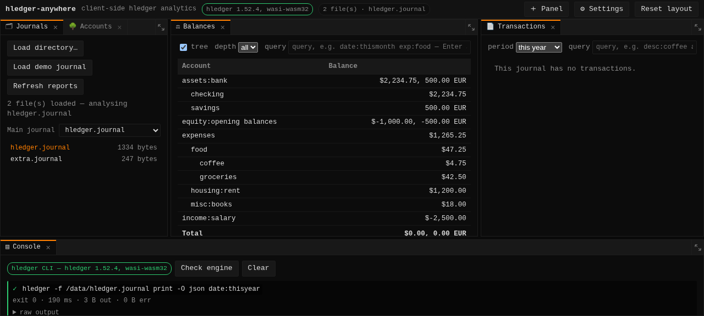

# hledger-anywhere

A client-side, easily extensible analytics platform for [hledger](https://hledger.org)
journals. Everything runs in the browser: there is no server, no upload, and no
backend. You point it at a directory of journal files and it runs the real
**hledger CLI compiled to WebAssembly** against them.



## What works today

- **Load a directory** of journal files from disk (`<input webkitdirectory>`),
  or the built-in demo journal with one click.
- **Multi-file journals**: the whole loaded directory is mounted into the
  engine's filesystem, so `include` directives resolve exactly as they do on the
  command line.
- **Main-journal selection**, with a heuristic that prefers the file that
  includes the others, then conventional names, and finally generates an
  include-root when the choice is genuinely ambiguous. Any loaded file can be
  chosen manually.
- **Reports**: an account tree, a balance report with `--tree`/`--flat` and
  `--depth` controls, the full transaction list, and a running-balance register.
- **A hledger query field on every report panel.** Anything hledger's query
  language can express — `date:thismonth`, `payee:"coffee shop"`, `exp:food`,
  `not:...` — is reachable without waiting for a purpose-built view. It applies
  on Enter rather than per keystroke, because each applied query is a whole
  engine invocation and a large journal takes seconds to re-parse.
- **Drill down from a figure to its postings.** Account names in the Balances and
  Expenses tables are links: clicking one opens a Register for that account — or
  points the one already open at it, raised to the front — with the query field,
  the report and the argv all following. It is the one connection between panels,
  and it exists because the question a balance report raises ("what is this made
  of?") is the one a register answers.
- **Sortable columns** on the report tables, on the header itself, with the
  direction chosen per column: accounts A–Z, amounts biggest-first, dates
  newest-first. The Register is deliberately unsorted — its total column is the
  sum of every row before it, so re-ordering would falsify it rather than
  re-order it.
- **A Console panel** that records every engine invocation — argv, exit code,
  duration, output sizes and raw output. This is the surface that makes a
  surprising number traceable to the exact command that produced it.
- **A Golden-Layout-style shell**: nested row/column splits, tabbed stacks,
  draggable splitters, per-tab close, an add-panel menu, and a layout that
  persists to `localStorage`.
- **Drag-and-drop docking, Golden Layout style**: drag a tab onto another pane to
  join its tabs, or onto one of its edges to split against it. The target region
  is highlighted, and a small label travels with the pointer so it is always
  clear which panel is being carried.
- **Tab reordering**: drag a tab along a tab bar, or onto another stack's, to
  choose its position. A thin insertion bar shows exactly where it will land.
- **Maximise and restore**: the button at the end of each tab bar fills the
  layout with that stack and puts it back. The tree underneath is untouched, so
  restoring is exact — no split or size can be lost.
- **Analytics**, from hledger's own reports rather than reimplemented ones: a
  balance sheet with its net-assets figure (`balancesheetequity`), an income
  statement (`incomestatement`), a cash flow statement (`cashflow`), a
  balance-over-time chart (`balance --historical`), a running-balance register
  (`register --historical`), an expenses breakdown chart (`balance expenses
  --tree`), a **payee breakdown** and a budget table (`balance --budget
  --monthly`, actual against goal with the variance). The three statements share
  one renderer, because a compound report is a compound report. The time-series
  chart is drawn with [uPlot](https://github.com/leeoniya/uPlot), vendored under
  `assets/js/vendor/uplot/` with its version and SHA-256 recorded in a README
  beside it — this project has no npm step, so the library is pinned like the
  engine is.

  The payee breakdown is the one report hledger cannot produce for us:
  `balance --pivot payee` returns an empty report in the shipped engine, while
  `register --pivot payee` works. So the panel runs the register and totals it in
  Rust, because once pivoted a posting's *account* is the payee. The grouping is
  pure and tested on the host.
- **Phone-shaped by default**: a narrow screen gets one panel at a time as tabs
  rather than three columns of clipped figures, and a layout arranged on a wider
  screen opens stacked instead of squeezed.
- **An interactive terminal**: a scrollback and a command line that runs any
  hledger command against the loaded journal, with `Tab` completion for commands,
  flags, account names and file paths, and a persisted history.
- **A Bloomberg-Terminal look**: near-black with an amber accent, monospace
  throughout, and no theme picker — the palette is a decision, not a preference.
  Everything is driven by one block of CSS custom properties, so restyling is a
  single edit.
- **A main-currency setting**: pick one of the commodities the journal actually
  uses and every amount report is re-denominated through hledger's
  `--value=end,COMM --infer-market-prices`.
- **Local persistence**: the layout, the settings and the terminal history live in
  `localStorage`; the loaded journal itself is cached in IndexedDB, so a
  returning visit can reopen the last session without picking the directory
  again.

The demo above shows `expenses:misc:books $18.00`, which comes from a *different
file* reached through an `include` directive — the clearest evidence that the
engine is reading the user's journal, not a copy of it.

## Quick start

```sh
# One-time: fetch the pinned hledger WASM artifact (see "The engine" below).
sh scripts/fetch-hledger-wasm.sh

# Build and serve.
. scripts/env.sh
trunk serve            # http://127.0.0.1:8080
```

`scripts/env.sh` must be sourced before any build command. It puts the
workspace-local tooling on `PATH` and redirects caches (`CARGO_HOME`,
`XDG_CACHE_HOME`, `npm_config_cache`) into `.tools/`. Those redirects are what
let the project build under a restricted filesystem sandbox, and they are
overridable, so on an ordinary machine your existing caches are used unchanged.

Toolchain: Rust ≥ 1.88 with the `wasm32-unknown-unknown` target, and
[Trunk](https://trunkrs.dev) 0.21.x. If `trunk` is missing:

```sh
curl -sSL -o /tmp/trunk.tar.gz \
  https://github.com/trunk-rs/trunk/releases/download/v0.21.14/trunk-x86_64-unknown-linux-gnu.tar.gz
tar xzf /tmp/trunk.tar.gz -C .tools/bin trunk
```

## The engine

hledger is a Haskell program, so "run hledger in the browser" means compiling it
to `wasm32-wasi` and driving it as a WASI command module. The app does that via a
**Web Worker**, because `_start()` is synchronous: on the main thread every
report would freeze the tab.

Three layers, each replaceable on its own:

| Layer | Where | Responsibility |
|---|---|---|
| Bridge (JS) | `assets/js/hledger-worker.js`, `assets/js/hledger-wasi.js` | Compile the module once, build the in-memory filesystem, capture raw stdout/stderr, report the real exit code |
| Boundary (Rust) | `src/hledger/bridge.rs` | Call `window.hledgerWasi` and turn its result into `HledgerOutput` |
| Engine + argv (Rust) | `src/hledger/mod.rs`, `src/hledger/report.rs` | Describe reports declaratively and build the argv each engine flavor expects |

The published `hledger-wasm` JavaScript bridge is **not** used. It re-fetches and
re-instantiates the ~18 MB module on every call, and captures output with a
line-buffered writer that would drop a trailing partial line — which corrupts
JSON that does not end in a newline.

### Two flavors, one interface

`wasm.lock` records which engine the app targets, and `build.rs` bakes it into
the binary so the argv dialect can never disagree with the artifact:

| `flavor` | argv | Commands |
|---|---|---|
| `hledger-cli` | `hledger -f /data/<journal> <cmd> -O json [args…]` | all, with the full report/query surface |
| `hledger-wasm-bridge` | `hledger-wasm <cmd> /data/<journal> [args…]` | `accounts`, `print`, `balance`, `aregister`, `commodities` |

The second is the interim artifact from the `hledger-wasm@0.1.0` npm package. It
is not the hledger CLI: it is a ~78-line Haskell wrapper around `hledger-lib`
whose `balance` is a flat per-account sum with no tree, periods or queries. It is
supported so the app stays demonstrable, and `Flavor::supports_report_options`
lets panels hide options that would otherwise be silently ignored.

### Building the real hledger CLI

```sh
sh scripts/build-hledger-wasm.sh      # long: toolchain download + a full build
```

This installs the [`ghc-wasm-meta`](https://gitlab.haskell.org/haskell-wasm/ghc-wasm-meta)
toolchain (GHC 9.12 flavour, matching hledger 1.52.4's `tested-with`), clones the
pinned hledger tag into `vendor/`, and builds with `hledger-wasm/cabal.project`.
That project file exists to substitute a local `terminal-size` stub: the real
package queries the terminal with an `ioctl`, which does not exist under WASI.
When it finishes, the script prints the values to put back into `wasm.lock` —
set `flavor = "hledger-cli"` and the new `size`/`sha256`.

#### Current status of that build: blocked, with a known cause

The toolchain installs, hledger 1.52.4 resolves, and ~30 of its ~150
dependencies build. It then fails on **`basement-0.0.16`**:

```
cbits/foundation_system.h:57:5: error: "foundation: system: Unknown compiler"
```

`basement` detects the host OS/architecture with C preprocessor macros and has no
branch for `wasm32-wasi`. It is reached through
`hledger` (exe) → `req` → `crypton` → `memory` → `basement`.

Two things are worth knowing, because they explain why this is a small,
well-scoped problem rather than a mystery:

- The dependency is pulled in by the **`hledger` executable package**, not by
  `hledger-lib`. `req` and `http-client` are unconditional dependencies of the
  exe, used for its price-downloading feature. This is exactly why the reference
  `hledger-wasm` project was able to build: it linked `hledger-lib` only.
- The failure is in one C header, not in hledger.

The two candidate fixes, in order of preference:

1. **Stub `req`.** Add a local package named `req` exposing only the surface the
   hledger exe actually uses, exactly as `terminal-size-stub` already does for
   `terminal-size`. This removes the whole crypton/TLS/memory/basement subtree. A
   browser has no business downloading prices anyway.
2. **Patch `basement`.** Vendor it and add a `wasm32-wasi` branch to
   `foundation_system.h`; its C is otherwise portable.

**This is now done.** `scripts/build-hledger-wasm.sh` builds the real hledger CLI
for wasm32-wasi, and `wasm.lock` points at it (`flavor = "hledger-cli"`). Three
adaptations were needed, two of which only surface once the real CLI runs:

1. `req` + `http-client` stubs (above), which remove the C subtree.
2. **`-threaded` must be dropped.** GHC's wasm backend has no threaded RTS — the
   toolchain ships `libHSrts-1.0.3.a` but no `_thr` — while hledger's executable
   stanza asks for it, so linking fails with "unable to find library". The build
   script removes the flag from the vendored `.cabal` with `sed` (idempotent, and
   `vendor/` stays a pristine clone). WASI has no threads in any case.
3. **`PATH` must exist in the WASI environment.** The real CLI looks it up (it
   scans for add-on `hledger-*` commands) rather than defaulting, and the WASI
   shim turns a missing variable into a hard failure. The worker passes `PATH=/`,
   so the lookup succeeds and finds no add-ons.

The interim `hledger-wasm-bridge` artifact remains a supported flavor; setting
that value in `wasm.lock` reverts the app to the reduced command set described
above.

## Adding a panel

This is the extensibility story, and it is deliberately one step:

1. Add a module under `src/panels/` with `pub fn view(id: PanelId) -> AnyView`.
2. Add one entry to `PANELS` in `src/panels/mod.rs`.

The layout tree, tab bar, add-panel menu, layout-persistence validation and the
default layout all read from that table, so nothing else needs to learn about the
new report. The entry's position also determines where it lands in the default
layout.

A panel that shows a report gets its state machine for free:

```rust
Effect::new(move |_| {
    let _ = state.generation.get();   // re-run when the journal changes
    let _ = state.refresh.get();      // re-run on Refresh
    state.report_for(id, ReportSpec::json("incomestatement"));
});

report_view(state, id, |output| { /* decode output.stdout */ })
```

`report_view` renders loading, failure and ready states, and a failure can only
come from the engine's exit code or stderr — so a broken run can never be
mistaken for an empty journal.

## Architecture notes

The crate is split along a wasm boundary that the compiler enforces:

- **Pure modules** (`journal`, `layout::model`, `hledger::report`,
  `hledger::mod`) never touch `web_sys`/`js_sys`. They compile for the host and
  are covered by `cargo test`.
- **Browser modules** (`app`, `layout::view`, `panels`, `hledger::bridge`,
  `fsx`, `state`) are behind `cfg(target_arch = "wasm32")`.

Because the wasm-only dependencies are themselves target-gated in `Cargo.toml`,
`cargo test` builds a small, fast, host-native crate. A `web_sys` import cannot
silently leak into logic that has to stay testable.

Two design decisions are worth knowing before changing them:

- **A splitter drag never touches the model.** Re-rendering the tree on every
  pointermove would replace the element that holds the pointer capture and break
  the gesture, so the drag writes `flex-grow` straight to the two DOM nodes and
  commits the final delta on pointer-up — and even then *without notifying*, so
  the tree is not rebuilt to change two numbers. This is why nothing may read
  `AppState::drag` reactively in a view.
- **Requesting a report is idempotent.** A panel's effect re-runs whenever the
  panel is re-rendered, and panels are re-rendered by any layout change, so
  without a guard resizing a splitter would silently re-run every report in the
  app. `report_for` records what each panel's result was computed for —
  journal generation, refresh generation, and the exact report options — and
  ignores a request it has already satisfied. Anything that invalidates a result
  (loading a journal, refreshing, changing an option) changes the key.
- **Nothing that follows the pointer is reactive.** Both gestures write straight
  to the DOM inside the pointer event: the splitter sets two `flex-grow` values,
  and the drop indicator is positioned with `style.setProperty`. Routing either
  through a signal is the thing that makes a drag feel soft — the update lands in
  a later task, so the feedback trails the input *by a frame even at a locked
  60 fps*, and the user is always watching something slightly behind the thing
  they are moving. For the same reason a splitter drag performs no reactive
  write at all: the two panes it resizes are resolved once at pointer-down, and
  the share delta is recomputed from the release position rather than
  accumulated, so nothing can re-render mid-gesture.
- **Docking measures once, not per frame.** A drag snapshots every pane's
  rectangle when it starts and then does pure arithmetic against that snapshot.
  Hit-testing by reading the DOM on each pointermove — `elementFromPoint` plus
  `getBoundingClientRect` — forces a synchronous reflow per frame, because the
  indicator has just been moved; measured, that was one forced layout per move.
  `hit_test` and `region_at` are pure and unit-tested.
- **Aiming is generous and unambiguous.** The gutter is a 5px hairline that
  hit-tests as a ~13px target, because a splitter you have to aim at reads as
  unresponsive even when it tracks the pointer perfectly. Dropping on a stack's
  *tab bar* means "join these tabs", resolved against the pane's body rather than
  the whole pane — otherwise the top edge of the content would sit a couple of
  pixels below the tab bar and turn an intended merge into an unintended split.
- **A pane's contents are contained.** `contain: layout paint` on each pane stops
  a resize from invalidating the layout of everything below it, which matters
  once a transaction table has thousands of rows.
- **A drag cannot get stuck.** Pointer capture is the normal way to follow a
  gesture past the element it started on, but it is not absolute: releasing
  outside the window or over browser chrome can take the capture with it and
  strand the drop indicator on screen. Every ending funnels through
  `AppState::end_tab_drag`, and document-level `pointerup`, `pointercancel` and
  `blur` guards catch the cases the tab never hears about.
- **Money never goes through a float.** hledger's JSON encodes a quantity as a
  mantissa and a scale plus a lossy `floatingPoint` convenience field; only the
  first two are used. `aquantity` is an *object*, not a number, which is easy to
  miss.

## Testing

```sh
. scripts/env.sh
cargo test                 # pure-module tests
cargo clippy --all-targets
```

The JSON fixtures in `fixtures/` were captured from a real hledger and are what
keeps the decoders honest; `fixtures/demo/` doubles as the built-in demo journal,
so the two cannot drift apart.

### Running the engine without a browser

`scripts/hledger-wasm.mjs` runs the *shipped* engine under Node's WASI, so a
report's exact bytes, exit code and flag behaviour can be checked in a second
instead of booting a browser and reading them off a panel:

```sh
node --experimental-wasi-unstable-preview1 scripts/hledger-wasm.mjs \
    fixtures/demo/hledger.journal balance --pivot payee
```

It is deliberately the shipped module rather than a system hledger: the app pins
a version, and a locally installed one can behave differently — which is exactly
how a feature can look broken locally and work deployed, or the reverse. Two
findings that came out of it: `balance --pivot payee` returns an empty report in
1.52.4 while `register --pivot payee` works, and `print date:thisyear` is empty
for any journal whose data ends in a past year, which is what the Transactions
panel's empty state now explains.

### Verifying the directory picker

The picker is the one part that cannot be unit-tested, and it has two failure
modes that both look like "the button does nothing", so it is worth knowing how
to check it:

- **The dialog must be opened synchronously**, from inside the click handler.
  Browsers gate a file picker on transient user activation, so routing the click
  through `spawn_local` — which defers it to a later task — makes it get refused
  *silently*: no dialog, no error, and a promise that never settles.
- **The click has to exist at all.** An input that is created and awaited but
  never clicked has the same symptom.

Both are checkable in a real browser without touching the OS dialog by recording
the call, then driving a selection over CDP:

```js
// 1. Record that the picker is requested, and by which element.
HTMLInputElement.prototype.click = function () { window.__c.push(this.id); };

// 2. After clicking "Load directory…", confirm a click was issued on a
//    type=file input with webkitdirectory set, and that the panel shows
//    "Reading directory…".

// 3. Populate the selection. CDP's DOM.setFileInputFiles cannot fill a
//    directory-mode input (Chrome answers with `cancel`), so drop that one
//    attribute first; everything else in the code path stays as shipped.
```

Note that the accessibility tree in headless Chrome can report structure without
any text, so read `document.querySelector(...).innerText` rather than trusting a
snapshot when checking what a panel says.

## Known limitations

- Reports run on the real hledger CLI, built for wasm32-wasi. The artifact is not
  committed (`assets/wasm/*.wasm`), because it is a 13 MB binary that changes only
  when hledger does. Locally it comes from `artifacts/hledger.wasm` after
  `scripts/build-hledger-wasm.sh`; CI downloads the release asset named in
  `wasm.lock`'s `url`. Publishing a new build is one command — see the header of
  `wasm.lock`. `sha256` is enforced whichever way the file arrives, so a stale or
  wrong upload is rejected rather than run, and the build fails loudly if no
  artifact is available at all. The interim bridge artifact remains a supported
  flavor.
- The layout covers docking, splitting, tab reordering, maximise and persisted
  sizes. What Golden Layout also has and this does not: **floating and popout
  panels**, a **tab overflow menu** (tabs scroll horizontally here instead), and
  **drop zones at the outer edge of the workspace** (a drop only targets the pane
  or tab under the pointer).
- Directory loading uses the `<input webkitdirectory>` picker, so a re-pick is
  required to see file changes. The File System Access API and live watching are
  not wired up.
- The journal snapshot is cached in IndexedDB so a later visit can reopen it
  without a pick, but file *changes* still require a re-pick.
- Reports re-run on journal change or on Refresh; there are no timers.
- hledger's own `-O json` shapes are decoded case by case. A command whose output
  is not one of the decoded shapes will fail loudly rather than render a guess.
- The decoders deliberately cover the whole wire format, including reports no
  panel displays yet (`aregister`, cost basis, and some chart-axis helpers), so
  those modules carry an explicit dead-code allowance and are covered by tests
  instead.

## Deploying

Published at **<https://hledger.gru.fi>** via GitHub Pages, built by
[`.github/workflows/deploy-pages.yml`](.github/workflows/deploy-pages.yml) on
every push to `main`.

The build is entirely client-side, so deployment is just static files — with two
things that are easy to get wrong:

- **The hledger WASM module is not in the repository.** It is ~17 MB and pinned
  by URL and SHA-256 in [`wasm.lock`](wasm.lock). The workflow runs
  [`scripts/fetch-hledger-wasm.sh`](scripts/fetch-hledger-wasm.sh), which
  downloads it and verifies the checksum, before building. A build without it
  still succeeds and renders, but every report panel reports a missing engine —
  which is why the workflow asserts `dist/wasm/hledger.wasm` exists rather than
  trusting that it does.
- **`.nojekyll` and `CNAME` are written into `dist/` by the workflow.** Without
  `.nojekyll`, Pages runs the output through Jekyll, which drops files it
  considers special; `CNAME` is what keeps the custom domain attached to the
  deployment. Writing them at deploy time keeps the domain in one place and
  avoids depending on how a copy rule treats dotfiles.

### One-time setup

1. **Settings → Pages → Build and deployment → Source: GitHub Actions.**
   Not "Deploy from a branch" — the artifact has to be assembled at build time
   because the WASM binary is fetched rather than committed.
2. **Settings → Pages → Custom domain:** `hledger.gru.fi`, then enable
   "Enforce HTTPS" once the certificate is issued.
3. **DNS:** a `CNAME` record for `hledger` pointing at `lc-at.github.io`.

### Reproducing the deploy locally

```sh
. scripts/env.sh
sh scripts/fetch-hledger-wasm.sh
trunk build --release
# Serve it the way a host would, not from the filesystem: the app needs real
# HTTP for its module worker and for fetching the WASM module.
python3 -m http.server -d dist 8080
```

`file://` will not work, and neither will opening `dist/index.html` directly —
the page fetches `/wasm/hledger.wasm` and starts a module worker.

## Licensing

The application code is AGPL-3.0-or-later. **hledger itself is GPL-3.0-or-later**,
which is why `hledger.wasm` is kept as a separate, independently loaded WASI
module invoked over argv and stdio, never statically linked into the Rust wasm,
and pinned by tag and checksum so its corresponding source is always
identifiable. See [THIRD_PARTY_LICENSES.md](THIRD_PARTY_LICENSES.md).
